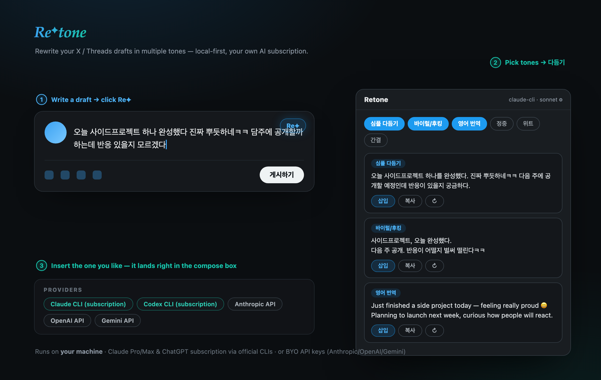

# Retone

[English](README.md) | [한국어](README.ko.md) | [日本語](README.ja.md) | [Français](README.fr.md) | [Deutsch](README.de.md) | **Español** | [简体中文](README.zh-CN.md) | [繁體中文](README.zh-TW.md)

Reescribe tus borradores de X (Twitter) / Threads en varios tonos, directamente dentro del cuadro de redacción — una extensión de Chrome + un asistente LLM local.



**Usa la suscripción que ya pagas.** Retone envuelve las CLI oficiales `claude` / `codex` como subprocesos headless, de modo que tu suscripción a Claude Pro/Max o ChatGPT Plus/Pro se encarga de la reescritura — sin extracción de tokens OAuth, sin servidores de terceros. También se admiten claves API propias (Anthropic / OpenAI / Gemini).

```
Chrome extension (content script on x.com / threads.com)
   │  localhost HTTP (127.0.0.1:7386, token auth)
   ▼
Local helper (zero-dependency Node ESM)
   ├─ claude-cli  : claude -p (Claude subscription)
   ├─ codex-cli   : codex exec (ChatGPT subscription)
   └─ anthropic / openai / gemini : your own API keys
```

## Instalación

### 1. Ejecuta el asistente

```bash
git clone https://github.com/soulduse/retone.git
cd retone
npm install          # devDeps for building the extension (the helper itself is zero-dep)
npm start            # starts the helper on 127.0.0.1:7386
```

**Inicio automático (recomendado, macOS)** — ejecútalo una vez y el asistente estará siempre en marcha tras iniciar sesión:

```bash
cd helper && node src/index.js install     # undo: uninstall
```

### 2. Compila y carga la extensión

```bash
npm run build        # produces extension/dist/
```

Chrome → `chrome://extensions` → activa el modo de desarrollador → **Cargar descomprimida** → selecciona `retone/extension/dist`.

### 3. Opciones

Abre la página de opciones de la extensión — **se conecta y se empareja con el asistente automáticamente** (sin copiar tokens; `POST /v1/pair`). Si el asistente no está en ejecución, se muestran instrucciones paso a paso.

1. Comprueba la conexión (la píldora de la esquina superior derecha se pone verde)
2. Elige un proveedor / modelo (Claude CLI: sonnet/haiku/opus, Codex: gpt-5.5, …)
3. (Opcional) introduce claves API para usar proveedores API — las claves se guardan únicamente en la configuración del asistente (`~/.config/retone/config.json`, modo 0600), nunca en el navegador

Si el emparejamiento automático llegara a fallar, pega manualmente la salida de `retone token` en los ajustes avanzados.

## Uso

1. Escribe un borrador en un cuadro de publicación/respuesta en x.com o threads.com
2. Haz clic en el botón **Re✦** en la parte superior derecha del cuadro de redacción
3. Selecciona presets de tono (se permiten varios) → **다듬기** (Refinar)
4. En cada tarjeta de resultado: **삽입** (Insertar en el cuadro de redacción) / **복사** (Copiar) / **↻** (Regenerar solo ese preset)

Siete presets integrados: Pulido simple · Cortés · Informal · Ingenioso · Conciso · Gancho viral · Traducción al inglés. Todos editables — además de presets personalizados — en la página de opciones.

> La interfaz de la extensión está actualmente en coreano.

## CLI del asistente

```bash
node src/index.js serve            # start the server (same as npm start)
node src/index.js token [--rotate] # print / rotate the auth token
node src/index.js status           # server status + provider availability
node src/index.js test "text" --provider claude-cli --preset polish,concise
node src/index.js install          # register launchd auto-start (macOS)
node src/index.js stop             # stop the server
```

## Desarrollo

```bash
npm run dev          # watch build for the extension
npm test             # helper unit tests (node --test)
cd extension && npx tsc --noEmit   # typecheck
```

Referencia de la API HTTP: [`docs/api.md`](docs/api.md)

## Notas

- **Términos de servicio**: extraer tokens OAuth y llamar a la API directamente está prohibido (y bloqueado del lado del servidor) desde 2026. Retone solo ejecuta los binarios CLI oficiales como subprocesos. Al lanzar `claude`, se elimina `ANTHROPIC_API_KEY` del entorno para que la CLI permanezca en modo suscripción (si la clave está presente, el uso pasa silenciosamente a la facturación por API).
- Los cambios en el DOM de X/Threads pueden romper la inserción directa — en ese caso, Retone recurre automáticamente a copiar al portapapeles. Los selectores de cada sitio están aislados en `extension/src/content/sites/`.
- Las reescrituras mediante proveedores CLI suelen tardar entre 5 y 15 segundos, y pueden ser más lentas cuando otras sesiones (p. ej., Claude Code) se ejecutan en la misma máquina. Elige un proveedor API (p. ej., Gemini Flash) si necesitas respuestas rápidas.

## Privacidad

Tu borrador pasa por el asistente local **únicamente hacia el proveedor de IA que hayas seleccionado**. Sin servidor de recopilación, sin telemetría, sin subida de registros. Las claves API se guardan solo en `~/.config/retone/config.json` (modo 0600).

## Licencia

MIT — úsalo, haz un fork, publícalo. Si te resulta útil, se agradece una ⭐.
